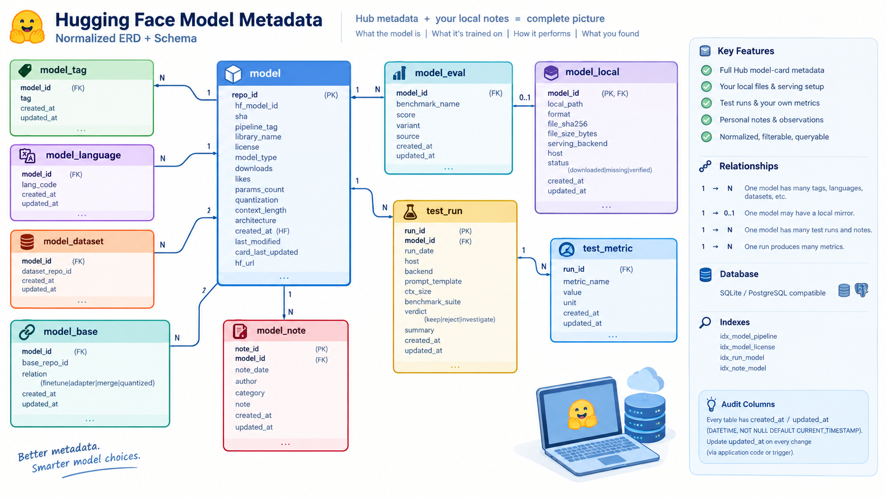

# model-momento

SQLite-backed database of model info: HF metadata, benchmark runs, notes.
FastAPI backend, single-file web UI, installable Hermes skill.

**Requirements:** Python 3.10+ (developed on 3.12). No Node build step.

Includes an installable Hermes skill (`model-momento/SKILL.md`) — say
"memento <huggingface-url>" to a Hermes agent with this skill and it will
import the model and open the notes UI.

## Install the skill

```bash
hermes skills install https://raw.githubusercontent.com/rahlquist/model-momento/main/model-momento/SKILL.md --yes
```

### If the install is blocked

The `hermes skills install` scanner (`skills-guard-v1`) can hard-block installs
on false positives — it pattern-matches things like `subprocess`, `os.environ`,
`base64`, or `curl | python`, and `--force` does **not** override a block. A
block is not proof the skill is malicious; this skill is pure prose (markdown
with example curl commands) and contains no executable code.

Workaround — install manually as a local skill:

```bash
git clone https://github.com/rahlquist/model-momento /tmp/mm-skill
mkdir -p ~/.hermes/skills/model-momento
cp /tmp/mm-skill/model-momento/SKILL.md ~/.hermes/skills/model-momento/SKILL.md
rm -rf /tmp/mm-skill
```

The directory name must equal the skill's `name` frontmatter
(`model-momento`) — the loader picks it up as a local enabled skill on the
next session. Verify with `hermes skills list` or by asking the agent to run
`skills_list`.


## Server setup

```bash
git clone https://github.com/rahlquist/model-momento
cd model-momento
python3 -m venv .venv
.venv/bin/pip install fastapi 'uvicorn[standard]'
.venv/bin/python -c "import sqlite3; c=sqlite3.connect('model_momento.db'); c.executescript(open('schema.sql').read())"
.venv/bin/python server.py        # binds 0.0.0.0:8765
```

Then open the UI — search, import from HF, create/edit records, enter notes
and benchmark runs, export a markdown card per model.

## Server

```bash
.venv/bin/python server.py        # binds 0.0.0.0:8765
```

Listens on all interfaces, so it is reachable from other LAN machines at
`http://<host-ip>:8765` (open the port in your firewall if needed). The
SQLite DB lives in `model_momento.db` (created on first run from
`schema.sql`; gitignored — it is per-machine data, not source).

## Web UI features

- Import from Hugging Face by `owner/name` (exact repo id)
- Create, edit, and delete model records
- Per-model notes (free-text, categorized)
- Benchmark runs with metrics and a verdict (`keep`/`reject`/`investigate`);
  claimed scores (card/leaderboard) are stored separately from measured ones
- Cross-table search (models, notes, runs, evals)
- **Export MD** — downloads a formatted markdown card: download link,
  metadata table, evals, runs, notes
- **Export Card** — PNG version of the card with a QR code linking to the
  HF page; courtesy credit line in the bottom-left
- **Copy link** — small 📋 button next to the link in the Metadata card;
  copies the HF URL with press animation feedback

## API reference

Base URL: `http://127.0.0.1:8765`

| Method | Path | Purpose |
|---|---|---|
| GET | `/api/models?q=&tag=&pipeline_tag=&limit=` | List/filter models |
| GET | `/api/models/{id}` | Full detail incl. tags, evals, runs, notes |
| POST | `/api/models` | Create (`repo_id` required, unique — 409 on dup) |
| PUT | `/api/models/{id}` | Update (replaces tags list) |
| DELETE | `/api/models/{id}` | Delete + cascade children |
| POST | `/api/notes` | Add note: `{model_id, note, category?, author?}` |
| POST | `/api/runs` | Record benchmark run; see body below |
| GET | `/api/runs?model_id=` | List runs with metrics |
| POST | `/api/evals` | Claimed score: `{model_id, benchmark_name, score, variant?, source?}` |
| GET | `/api/search?q=` | Cross-table search (models, notes, runs, evals) |
| GET | `/api/models/{id}/card.png` | Rendered PNG card with QR to the HF page |
| POST | `/api/import` | `{repo_ids: ["owner/name", ...]}` from HF |

`POST /api/runs` body: `{model_id, host?, backend?, prompt_template?,
ctx_size?, benchmark_suite?, verdict?, summary?, metrics:
[{metric_name, value, unit?}], note?}` — the `note` is stored as a
benchmark-category model_note. `verdict` must be `keep`, `reject`, or
`investigate`.

## Schema

10 normalized tables with `model` as the hub:

- Children (1:N via `model_id`): `model_tag`, `model_language`,
  `model_dataset`, `model_base`, `model_eval`, `model_note`, `test_run`
- `test_run` → `test_metric` (1:N via `run_id`) — your measured numbers
- `model_local` (1:0..1 — `model_id` is both PK and FK): local copies,
  sha256, serving backend, host, status



## Design notes

- `repo_id` (`owner/name`) is the exact natural key; duplicates are 409.
- `model_eval` = claimed scores; `test_metric` = measured numbers. Never mixed.
- `updated_at` is bumped by triggers; SQLite FKs are per-connection — use
  `-cmd 'PRAGMA foreign_keys=ON'` in ad-hoc `sqlite3` sessions.
